# Generador de mallas

Esto son una serie de scripts utilizados para crear, mallar (y en el futuro simular automaticamente) alas multielementos en 2D

Hace falta instalar Python, SU2 y Paraview. También recomendaría tener un editor de texto decente (vscode es muy bueno, pero notepad++ o cualquier otro os vale).

Además la primera vez es posible que haya que instalar algunas librerías de python. Para hacerlo,
hay que ejecutar en el terminal (después de instalar Python)

`pip install -r requirements.txt`

A falta de automatizar un poco más el proceso, el procedimiento de cero a simular un caso sería el siguiente:

### 1. Definición de la geometría
En el archivo `Mi_aleron.py` se importan los perfiles y se colocan segun se considere.
La manera en la que está estructurado es opcional, pero basicamente hay que definir las cuerdas, los ángulos de ataque y los gaps.

Primero, hay que importar los perfiles, la forma de hacerlo es en dos variables, una con la curva de intradós y otra de extradós:

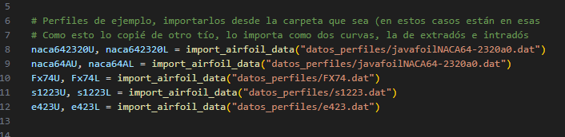

Para simplificar el proceso de ir cambiando los perfiles, después de importar los que quieras, hay que colocar las curvas de los que quieres en cada variable `elemXU, elemXL`

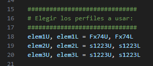

Después, hay unas variables ya creadas, con las cuerdas, los ángulos de ataque y los huecos para cada perfil, que podeis cambiar como veais.

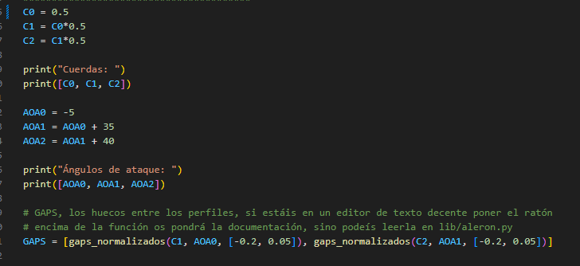

Los gaps entre alerones, por defecto son un porcentaje de la cuerda que le pases a la función (cuerda * gaps[0]) si prefieres que sean valores absolutos, hay que añadir el argumento relativo=False

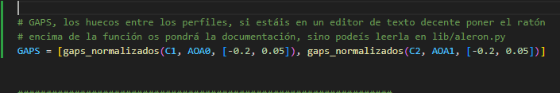

Mi recomendación es no cambiar este estilo, pero si quieres puedes hacerlo de estas formas también:

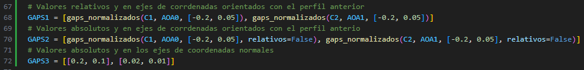

Una vez esté definido, hay que ejecutar ese programa, que escribirá los archivos con los puntos de los perfiles colocados a la carpeta que
se especificase (por defecto la carpeta tests, es recomendable cambiar esto y hacer para cada alerón una carpeta distinta)

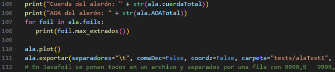

> NOTA el mallador que he hecho no leerá bien los archivos si cambias las otras settings (comaDec, separador, coordz, etc). Son más bien para exportar las curvas luego a solidworks, o ansys si quisieras, u otras plataformas

El programa antes de acabar hará una preview de la geometría que se ha creado y escribirá algunos datos que pudieran ser de relevancia.

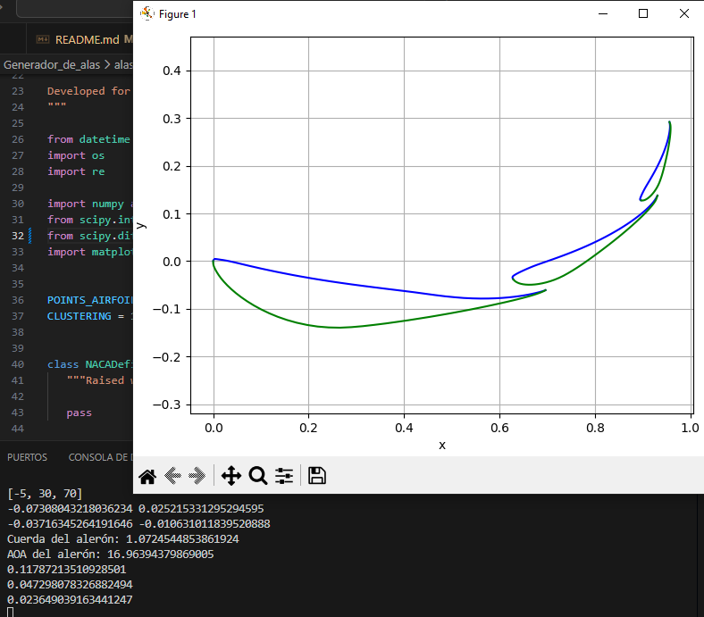

### 2. Mallado
Lo primero y principal que hay que hacer es cambiar los nombres de la carpeta y archivos a leer para que coincidan con los generados antes.

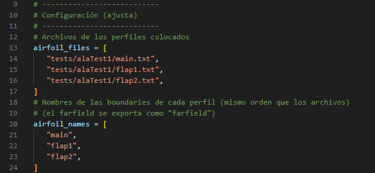

Más abajo, contiene varios parámetros que definen la calidad de la malla, el tamaño de la capa límite, el número de capas, etc.
Mi recomendación es no tocar los parámetros salvo los relacionados a la capa límite y el yplus que hayais calculado.

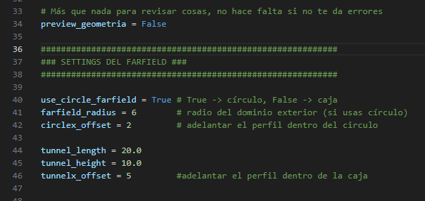

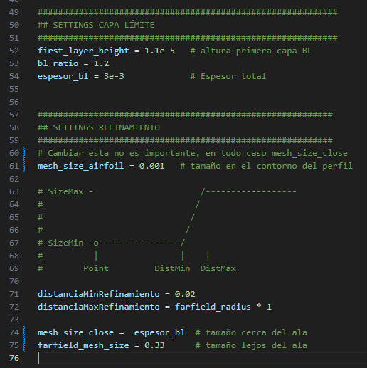

> NOTA No estoy seguro ahora mismo de que usar el volumen de control cuadrado funcione, recomiendo no cambiarlo

Una vez se tiene una carpeta que contenga los perfiles colocados, se debe ejecutar `python .\mallador.py` en el terminal.
Tras ejecutar este programa, lanzará una ventana de gmsh (no debería de haber que descargarlo creo) en la que se muestra la malla, después de cerrar este ventana guardará la malla en el
archivo también especificado anteriormente (por defecto airfoil_simple.su2) (si se va a usar SU2 los archivos deben ser del tipo .su2, gmsh se encarga de que la malla esté en ese formato automaticamente según la terminación del nombre del archivo que se especifique)

Una estimación para tener en cuenta, por cada 100k nodos (o elementos no estoy seguro ahora mismo) cada iteración me tarda 1 segundo en correr, y en converger tarda unas ~3500 iteraciones (muy grosso modo)
Esto es posible que se pudiera mejorar el numero de iteraciones para converger/velocidad por iteración con una configuración del solver distinta (aumentando el numero de courant (tiempo en converger) y en lugar de INC_RANS, INC_Euler (velocidad por iteración) (INC = incompresible)), pero la que doy por defecto es de fiar al menos (más tarde vemos las settings del solver).

La configuración por defecto genera mallas relativamente simples, que no tardan mucho en simularse, si lo cambias para que tenga mejor resolución, los tiempos aumentarán drásticamente.

> NOTA!! Es posible que para otros formatos de malla y sobretodo solvers no sirva simplemente con cambiar la terminación del archivo, este programa solo lo he progado con SU2, por ejemplo para OpenFOAM lo más fácil sería exportar la malla como .msh (formato de gmsh) y luego convertirla
con la herramienta que OpenFOAM ofrece (no es el tema de este programa y no voy a desarrollarlo más)

### 3. Simulación con SU2
Por último, para simular el caso, hace falta, evidentemente tener SU2, y para visualizar los resultados y el flujo Paraview, ambos programas gratuitos.
(Es probable que tengas que añadir la carpeta con los ejecutables de SU2 al "path" de tu ordenador para que lo pueda "encontrar" desde cualquier carpeta de tu ordenador si no sabes como busca en google o preguntame, pero es relativamente fácil).
Para hacer una simulación hacen falta dos archivos:
   1. La malla (.su2)
   2. El archivo de configuración (.cfg)

El archivo de configuración contiene todos los detalles sobre el tipo de simulación y los parámetros de esta (Modelo de flujo, velocidad incidente, y un largo etc.)

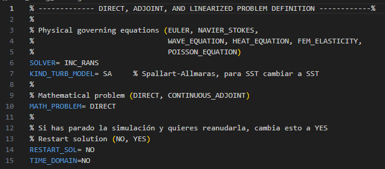

Por suerte no hace falta entender ni tocar gran parte de este archivo, en las primeras líneas vienen los parámetros a cambiar (velocidad del flujo, densidad, etc)

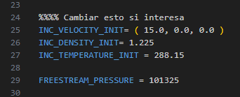

Y en las últimas líneas el nombre del archivo de la malla: `MESH_FILENAME= airfoil_simple.su2` que habrá que cambiar por el que sea que tiene tu archivo (si no lo habeis cambiado en el `mallador.py` será igual).

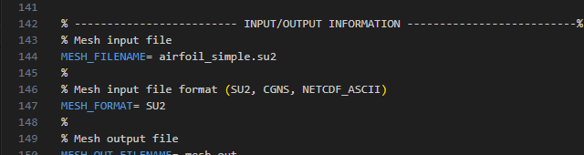

Una vez esté la configuración hecha, hay que ejecutar en el terminal:
`SU2_CFD .\[nombre_del_archivo_de_configuración].cfg`, si no le cambias el nombre al que ya viene: `su2_config_base.cfg`

### 4. Resultados
SU2 irá poniendo en pantalla los residuals, el cl y el cd, pero para poder ver el flujo y una gráfica de los residuals y los coeficientes a lo largo de las iteraciones
hace falta usar Paraview, también proveo un plantilla con la visualización del flujo y la gráfica ya creadas `flow_view.pvsm`, hay que abrir Paraview,
y en File>load case navegar hasta esta carpeta, y seleccionar `flow_view`

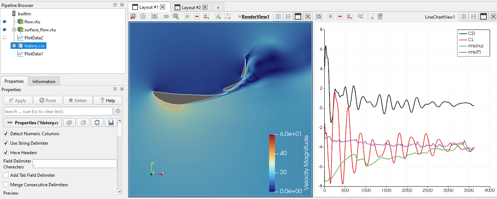

> NOTA: Al abrir el archivo, hay que "sustituir" los archivos y seleccionarlos manualmente.
Al abrirlo dirá algo como "replace with local files", si no lo haceis ahí, os dará varios errores pero luego podeis simplemente hacer click derecho en `flow.vtu`, `surface_flow.vtu` y `history.csv`, darle a change file y elegir "los mismos" archivos de la carpeta.

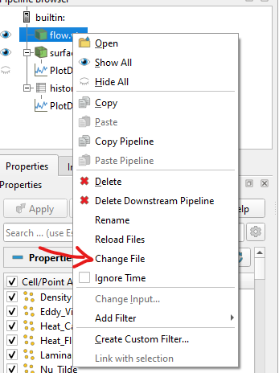

Para refrescar los archivos y que se actualicen basta con darle a F5

En la pestaña de Layout-2 hay una gráfica (un experimento feo) de el Cp y el Y+ a lo largo de la cuerda del perfil, por desgracia al ser los tres perfiles "la misma" surface, se raya y se llena de líneas feas, sin embargo, creo que si se ignoran las rectas las gráficas siguen siendo utiles

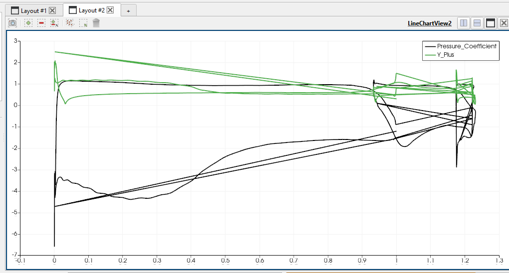
